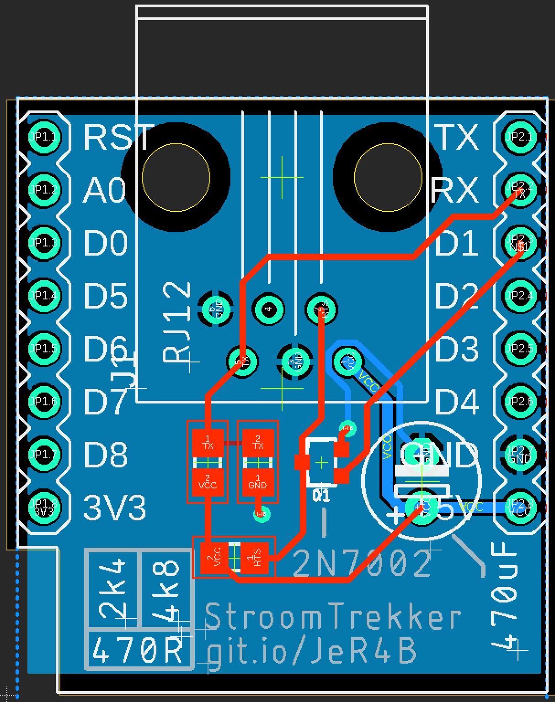

# stroomtrekker
Kloon van Pwuts' MeterTrekker.

Boards have *just* been ordered, so make these at your own risk.

## BOM
### Semiconductors
* 1x Wemos D1 mini or ESP32 D1 mini
* 1x 2N7002 mosfet (or any generic SOT23 mosfet will probably work)

### Resistors
(all 0805 size)
* 1x 470R
* 1x 2K4
* 1x 4K8

### Capacitors
* 1x 470uF 6.3V

### Connectors and cables
* 1x RJ12 connector
* 1x RJ12 cable
